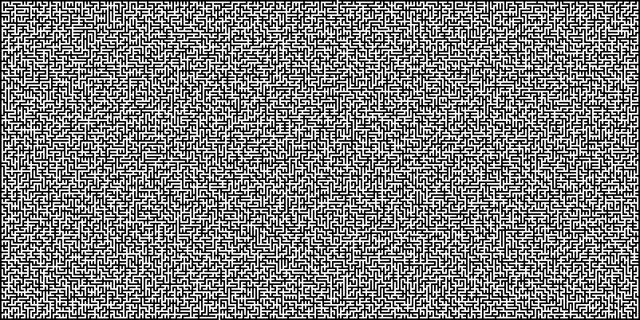

# Kruskal Maze Generator

## Sobre

Esse programa utiliza o algoritmo de Kruskal para gerar labirintos, criando aleatoriamente caminhos entre as células (inicialmente todas trancadas), até que haja um caminho de uma célula para qualquer outra, sem haver ciclos.

## Screenshots




## Instalação e execução

Com Python 3 instalado na máquina, primeiro faça no terminal:
```
pip install -r requirements.txt
```
E depois, basta rodar a main.py:
```
python3 src/main.py
```
E seguir as instruções durante a execução. Ao terminar de executar, o programa criará o arquivo de imagem *maze.png* dentro do diretório usado para execução.
