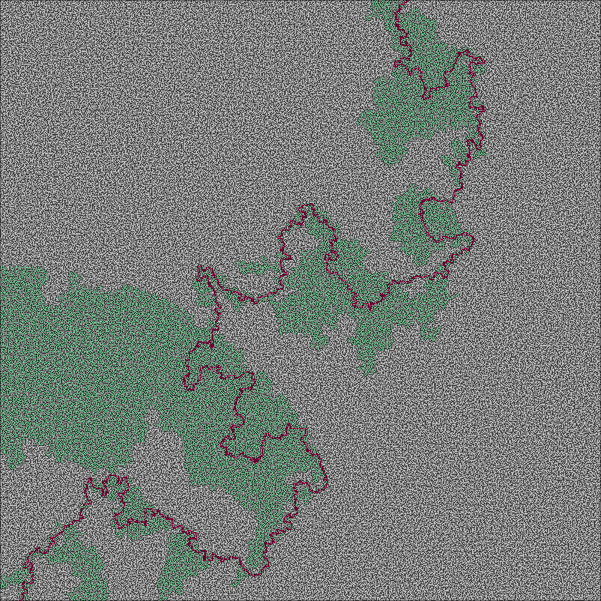

# Kruskal Maze Generator

## Sobre

Esse programa utiliza o algoritmo de Kruskal para gerar labirintos, criando aleatoriamente caminhos entre as células (inicialmente todas trancadas), até que haja um caminho de uma célula para qualquer outra, sem haver ciclos.

## Screenshots


## Solver

O módulo solver carrega uma imagem de um labirinto gerado pelo módulo generator e gera imagens com a solução do labirinto utilizando os algoritmos de busca escolhidos.

As buscas implementadas são:

- bfs: Busca em largura
- dfs: Busca em profundidade
- as: Algoritmo A* utilizando distância euclideana.

Exemplo de uso:


Os pontos verdes na imagem gerada são os nós que foram explorados durante a busca.

### BFS


### DFS


### A*



## Instalação e execução

Com Python 3 instalado na máquina, primeiro faça no terminal:
```
pip install -r requirements.txt
```
Para gerar labirintos, basta rodar a main.py:
```
python3 src/main.py
```
E seguir as instruções durante a execução. Ao terminar de executar, o programa criará o arquivo de imagem *maze.png* dentro do diretório usado para execução.
